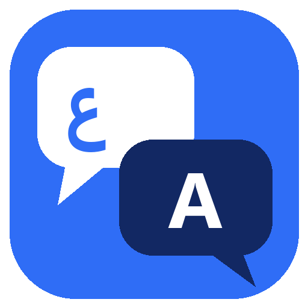
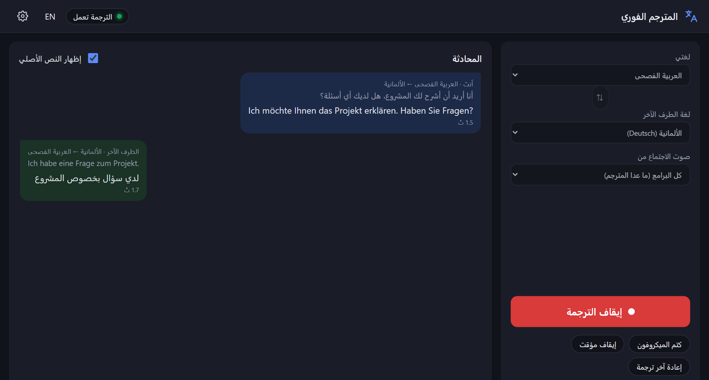

<div align="center">



# AI Live Translator · المترجم الفوري

**Real-time, two-way voice translation for calls and meetings on Windows — 100% local**


</div>

<p align="center">
  
</p>

You speak your language and the other side hears theirs; they answer in theirs and you hear yours.
It works with **Zoom, Teams, Google Meet, Discord** or any other app, because it acts as a virtual
microphone and listens to the meeting's audio. All AI models run **on your own PC**: it's free,
works offline after the first run, and your voice never leaves the machine.

```
Your mic (Arabic)  → speech-to-text → translate → German voice → virtual mic (CABLE) → Zoom / Teams / Meet
Meeting audio (DE) → speech-to-text → translate → Arabic voice → your headphones
```

## Features

- **Two-way live pipeline**: voice activity detection → speech recognition → translation → speech synthesis, in parallel for both directions
- **103 languages** for understanding and translation (Arabic ↔ German is the main target), with auto-detection; about 50 have natural voices that download on first use
- **Virtual microphone** through VB-CABLE, so any meeting app hears the translated voice
- **Per-app meeting capture**: a small C# helper uses the official Windows *process loopback* API to capture the meeting's audio while excluding the translator's own output, so there's no echo loop
- **GPU acceleration** on NVIDIA cards (CUDA libraries are downloaded automatically) with a CPU fallback using a smaller model
- **Desktop UI** in Arabic and English: conversation view with original + translation, mute, pause, replay last translation, and a quick demo that needs no meeting
- **First-run setup** downloads the models (~3 GB, 4.5 GB with GPU libraries), resumable on slow connections
- One-click **Windows installer** (Inno Setup)

## How it works

| Stage | Engine |
|---|---|
| Voice activity detection | Silero VAD |
| Speech-to-text | faster-whisper (`large-v3-turbo` on GPU) — CTranslate2 |
| Translation | NLLB-200 via CTranslate2 |
| Text-to-speech | Piper (local neural voices) |
| Meeting audio capture | `native/ProcessLoopback` — C# / WASAPI process loopback |
| App shell | FastAPI + WebSocket engine, pywebview (Edge WebView2) UI |
| Packaging | PyInstaller + Inno Setup |

## Project layout

| Folder | Contents |
|---|---|
| `backend/app/` | The engine: audio, providers (STT / translation / TTS / VAD), live session, local API server, UI |
| `backend/scripts/` | Step-by-step demo scripts for each build phase (mic → text, → translation, → voice …) |
| `backend/tests/` | 106 tests (model and audio-device tests are opt-in) |
| `native/ProcessLoopback/` | C# helper that captures one app's audio |
| `packaging/` | PyInstaller spec, Inno Setup script, release script |
| `docs/` | [Architecture](docs/ARCHITECTURE.md) · [Platforms](docs/PLATFORMS.md) · [Testing](docs/TESTING.md) · [Accounts & SaaS plan](docs/SAAS.md) |

## Run from source

```bash
cd backend
uv venv --python 3.11 .venv
uv pip install --python .venv -e ".[dev]"
.venv\Scripts\python -m app.desktop     # start the app
.venv\Scripts\python -m pytest          # run the tests
```

Build the installer:

```bash
powershell -ExecutionPolicy Bypass -File packaging\build_release.ps1 -Version 1.0.2
```

Models are not in the repository. In dev mode they go to `backend/models/`; the installed app keeps them in
`%LOCALAPPDATA%\AI Live Translator\models`.

### Using it in a meeting

1. Install the free [VB-CABLE](https://vb-audio.com/Cable/) driver (run as administrator, then restart).
2. Open the app, pick your language and the other side's language, then press **Start translation**.
3. In Zoom/Teams/Meet, choose **CABLE Output** as the microphone.
4. Use headphones.

> ⚠️ **License note:** the NLLB translation model is **non-commercial** (CC-BY-NC 4.0). It has to be replaced before
> any commercial use. See [docs/SAAS.md](docs/SAAS.md).

---

## بالعربي

**المترجم الفوري** بيترجم صوتك وصوت اللي بتكلمه في نفس اللحظة، في الاتجاهين، جوه أي اجتماع (زووم، تيمز، ميت، ديسكورد).
إنت بتتكلم عربي والطرف التاني بيسمعك ألماني، وهو بيرد ألماني وإنت بتسمعه عربي.

- كل الذكاء الاصطناعي شغال **على جهازك**: مجاني، ومن غير إنترنت بعد أول تشغيل، وصوتك مش بيتبعت لأي مكان.
- بيدعم **103 لغات**، وحوالي 50 منهم ليهم صوت طبيعي.
- بيستخدم كارت الشاشة NVIDIA لو موجود عشان يبقى أسرع، ولو مش موجود بيشتغل بموديل أصغر.
- طريقة الاستخدام: نزّل VB-CABLE، وافتح البرنامج، واختار اللغتين، ودوس **ابدأ الترجمة**، وفي برنامج الاجتماع اختار المايك **CABLE Output**.
